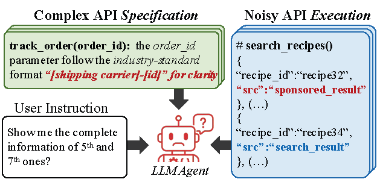
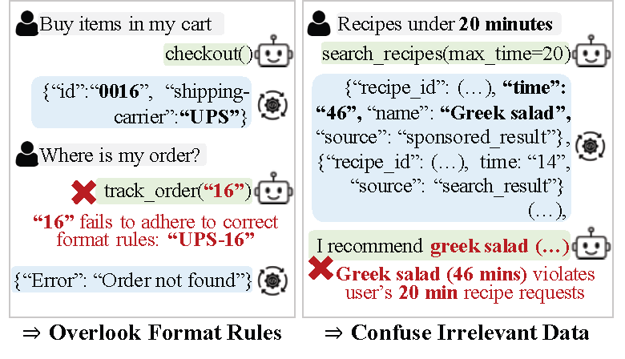

# Beyond Perfect APIs: A Comprehensive Evaluation of LLM Agents Under Real-World API Complexity

## Overview
We introduce **WildAGTEval**, a benchmark designed to evaluate the function-calling capabilities of LLM agents under realistic API complexities. In contrast to prior works that assume idealized environments, WildAGTEval rigorously accounts for two critical dimensions of real-world complexity as illustrated in the **Figure** below: **API Specification**, which encompasses detailed documentation and usage constraints (Figure (a) green region; Figure (b) left), and **API Execution**, which captures runtime challenges and noisy outputs (Figure (a) blue region; Figure (b) right). Consequently, the framework provides an API system featuring **60 distinct complexity scenarios** (refer to `API_Complexity/UNCERTAINTY_ENVIRONMENT_VARIABLES.md`) that can be composed into over **32K test configurations**, alongside a comprehensive set of user-agent interactions for evaluation.

<div align="center">
  
</div>`
<div align="center">
  
</div>`

## Navigation

1. [Setup](#setup)
2. [Quick Start](#quick-start)
3. [Run ALL](#run-all)
4. [Evaluation](#evaluation)
5. [Manual API Complexity Setup for Your Own Complexity Environments](#manual-api-complexity-setup-for-your-own-complexity-environments)
6. [API System Structure and Example Usage](#api-system-structure-and-example-usage)
7. [Contact](#contact)
8. [Citation](#citation)

- **To execute evaluations:** Please refer to the [Quick Start](#quick-start), [Run ALL](#run-all), and [Evaluation](#evaluation) sections.
- **To create custom complexity environments or training datasets:** Please refer to the [Manual API Complexity Setup](#manual-api-complexity-setup-for-your-own-complexity-environments) and [API System Structure and Example Usage](#api-system-structure-and-example-usage) sections.

---

## Setup

1.  **Clone the Repository**

    Clone the repository
    ```bash
    git clone https://github.com/Demon-JieHao/WildAGTEval.git 
    ```

2.  **Set Up the Environment (Conda Recommended)**

    Establish the virtual environment using the provided configuration file.
    ```bash
    conda env create -f environment.yml -n wild_agt
    ```

3. **Configure Keys** with ***Amazon Bedrock***

    This framework primarily operates utilizing ***Amazon Bedrock***. Define the Bedrock credentials as environment variables as follows:
    ```bash
    export BEDROCK_ACCESS_KEY="..."
    export BEDROCK_SECRET_ACCESS_KEY="..."
    ``` 
    or you can use `aws configure` to register the above. For a comprehensive list of compatible models and their specifications, please refer to the [Supported Models Documentation](https://docs.aws.amazon.com/bedrock/latest/userguide/models-supported.html) and the [AWS Bedrock Model Catalog](https://us-east-1.console.aws.amazon.com/bedrock/home?region=us-east-1#/model-catalog).
    
4. Alternative with LiteLLM

    To incorporate external models via LiteLLM (e.g., OpenAI, Anthropic), configure the respective API keys as environment variables.
    ```bash
    export OPENAI_API_KEY=...
    export ANTHROPIC_API_KEY=...
    ```
    

5.  **Host Models via `vllm`**
    For the deployment of open-source models such as GPT-OSS-120B or Qwen-235B, utilize the `vllm_host.yaml` configuration. Ensure that the pod specifications and other parameters are appropriately adjusted.
    ```bash
    kubectl apply -f vllm_host.yaml
    ```
    
---
    
## Quick Start
This section demonstrates a representative workflow using the **Partially Irrelevant Information Complexity** scenario. Please note that this is merely one illustrative example selected from the diverse range of complexity types supported by the system. For further details on **all** complexity types and evaluation metrics, refer to the "Run ALL" section.

1. **Execute Inference**
   Conduct inference experiments to compare system performance under two distinct conditions: ***with*** the injection of irrelevant data complexity and ***without*** it.

   **Case 1: With Irrelevant Data Complexity**
   ```bash
   # Enable irrelevant data complexity configuration
   cd API_Complexity
   
   ./unified_conversation_tester.sh \
       --model-id "us.anthropic.claude-3-7-sonnet-20250219-v1:0" \
       --uncertainty-config "uncertainty_configs/partially_irrelevant.yaml" \
       --turn-level-tf --target-functions-config "uncertainty_configs/target_functions_params.yaml" \
       ...
    ```   
       
    **Case 2: Without Irrelevant Data Complexity**
   ```bash
   # Disable irrelevant data complexity (clean baseline)
    ./unified_conversation_tester.sh \
        --model-id "us.anthropic.claude-3-7-sonnet-20250219-v1:0" \
        --uncertainty-config "uncertainty_configs/none.yaml" \
        --turn-level-tf --target-functions-config "uncertainty_configs/target_functions_params.yaml" \
        ...
      ```
      > Output Location: The evaluation results of above execution will be stored in `API/results/Combined_transformed/`.

2. **Execute API Call Evaluation**
   To analyze and compare the results from the inference experiments, execute the evaluation script.

   ```bash
   cd API_Complexity && ./scripts/run_isolated_eval_analysis.sh
   ```
   Analysis Output: Results and statistical summaries will be available in:
`API/results/Combined_transformed/*_analysis/unified_batch_summary.txt`

    *Note: See the "Success Rate" metric within the result files `unified_batch_summary.txt`.*

    
3. **Understand Mechanism of Complexity Injection**
   The following explains the underlying mechanism of the complexity injection utilized in the examples above.

   * **YAML Configuration System:**
     The system employs YAML files to govern the injection of specific complexities.
     * `partially_irrelevant.yaml`: Enables irrelevant data injection (used in Case 1).
     * `none.yaml`: Disables irrelevant data injection (used in Case 2).

     ```yaml
     # uncertainty_configs/partially_irrelevant.yaml
     uncertainties:
       PARTIALLY_IRRELEVANT_INFORMATION:
         enabled: true
         apis: ["search_recipes"]
     ```

   * **Environment Variable Initialization:**
     Specifying the `--uncertainty-config` parameter automatically sets the corresponding environment variables (e.g., `ENABLE__PARTIALLY_IRRELEVANT_INFORMATION__SEARCH_RECIPES=true`).

   * **Runtime Application:**
     During execution, API functions inspect these variables to determine whether to modify responses.

     ```python
     # In API_Complexity/InformationControlEnv/tools/search_recipes.py
     
     uncertainty_enabled = os.getenv('ENABLE__PARTIALLY_IRRELEVANT_INFORMATION__SEARCH_RECIPES')
     if uncertainty_enabled:
        # [Complexity Mode] Returns response injected with irrelevant data
     else:
        # [Standard Mode] Returns clean, baseline response   
     ```
     For in-depth implementation details and evaluation protocols, please refer to the following source files:

        * **Implementation:** `API_Complexity/uncertainty_manager.py`
        * **Evaluator:** `API_Complexity/step_by_step_llm_evaluator_teacher_forcing.py`

---

## Run ALL

⚠️ **Caution regarding Resource Usage:**
It is important to note that executing the full evaluation suite detailed below requires significant computational time and will incur substantial API costs. 

The evaluation framework is structured into three distinct experimental configurations:

1. **Isolated Setup:** Evaluates the impact of individual complexity types in isolation.
2. **Isolated Setup for Error-Based Complexity:** Simulates explicit API failure modes, specifically targeting System Failures and Feature Limitation Errors.
3. **Cumulative Setup:** Assesses system robustness under compound complexity conditions where multiple factors interact simultaneously.


### 1. Isolated Setup 

This experimental phase rigorously evaluates the impact of individual complexity factors in isolation. The protocol comprises eight distinct experimental cases, comparing performance **with** and **without** specific complexities: **Ad-hoc Rule**, **Unclear Functional Boundary**, **Informational Notices**, and **Partially Irrelevant Information**.
The "Without Ad-hoc Rule" case—is executed via the following command:
```bash
cd API_NoComplexity && ./scripts/run_isolated_eval.sh
```
The remaining seven experimental cases are executed using:
```bash
cd API_Complexity && ./scripts/run_isolated_eval.sh
```
*Note:* Given the pervasive nature of Ad-hoc Rule complexity in real-world systems, the isolated effects of the other complexity types are evaluated within an environment where the Ad-hoc Rule is present, ensuring practical relevance.

**For vLLM-Hosted or LiteLLM Models**
The execution procedure remains identical to the standard setup described above, requiring only the substitution of the execution script. Utilize `run_isolated_eval_vllm.sh` or `run_isolated_eval_litellm.sh` depending on the hosting method.


### 2. Isolated Setup for Error-Based Complexity

This experimental phase focuses on evaluating system robustness under explicit failure conditions. The protocol comprises two distinct experimental cases designed to simulate real-world API malfunctions: **System Failure** and **Feature Limitation Errors**. These error-based scenarios are executed via the following command:

```bash
cd API_Complexity && ./scripts/run_error_based_complexity.sh
```
**For vLLM-Hosted or LiteLLM Models**
Please use `run_error_based_complexity_vllm.sh` or `run_error_based_complexity_litellm.sh` depending on the hosting method.


### 3. Cumulative Setup 

This experimental phase assesses system robustness under **compound complexity conditions**, where multiple uncertainty factors are superimposed. The protocol comprises five distinct experimental cases, progressing from a clean baseline to fully layered complexity scenarios: **None, Ad-hoc, +Unclear, +Info, and +Irrelevant**.

The "None Uncertainty" baseline is executed via the following command:
```bash
cd API_NoComplexity && ./scripts/run_cumulative_eval.sh
```
The remaining four cumulative scenarios (sequentially layering complexities) are executed using:
```bash
cd API_Complexity && ./scripts/run_cumulative_eval.sh
```
**For vLLM-Hosted or LiteLLM Models**
Please use `run_cumulative_eval_vllm.sh` or `run_cumulative_eval_litellm.sh` depending on the hosting method.

### 4. Dataset Configurations
Since the injection of **Ad-hoc Rule** complexity necessitates **ground truth label** modifications, the system utilizes the following dataset configurations:
* **Combined\***: Baseline datasets with **original labels** (without ad-hoc complexity).
* **Combined\*_transformed**: Datasets with **modified labels** (with ad-hoc complexity enabled).
* **Combined_deref\***: Datasets with **coreferences removed** for ablation studies.

Reference Directory: `API_Complexity/atomic_conversation_units/success_conversations/Combined*`

---

## Evaluation

Following the inference phase, the evaluation scripts quantify agent performance across the three experimental configurations.

### 1. Isolated Setup Evaluation
Executes the analysis for individual complexity types.

```bash
cd API_Complexity && ./scripts/run_isolated_eval_analysis.sh
```

### 2. Error-Based Setup Evaluation
Initiates the LLM Judge to evaluate system robustness under failure conditions (System Failure, Feature Limitation).
```bash
cd API_Complexity && ./scripts/run_error_based_complexity_evaluation.sh
```

### 3. Cumulative Setup Evaluation
Executes the analysis for compound complexity scenarios.

```bash
cd API/API_Complexity && ./scripts/run_cumulative_eval_analysis.sh
```

---

## Manual API Complexity Setup for Your Own Complexity Environments


### 1. Configuration Components
The experimental scope is defined by two primary parameters:
```bash
# 1. WHAT complexity to inject
--uncertainty-config "uncertainty_configs/partially_irrelevant.yaml"
# 2. WHICH functions to evaluate
--target-functions-config "uncertainty_configs/target_functions_partially_irrelevant.yaml"
```

### 2. Setting Complexity Type Config - "What Complexity to Inject"
Configuration files located in `API_Complexity/uncertainty_configs/`` govern the specific nature of complexity injection. Standard configurations include:
- `adhoc.yaml`: Enables ad-hoc rule complexities.
- `partially_irrelevant.yaml`: Enables extraneous irrelevant information into responses.
- `informational_notice.yaml`: Appends system notices or disclaimers.
- `system_failure_{function}.yaml`: Simulates specific API operational failures.
- `feature_limitation_{function}.yaml`: Simulates reduced functional capabilities.

### 3. Setting Target Functions Config - "Which Functions to Evaluate" for Isolated Setup
For the Isolated Setup, specific configuration files define the subset of functions under evaluation such as:
- `target_functions_partially_irrelevant.yaml`: Functions with irrelevant information complexities.
- `target_functions_adhoc.yaml`: Functions with ad-hoc rules.

### 4. Creating Custom Complexity Environment Configurations
Researchers may establish custom environments by creating YAML configuration files that adhere to the defined schema. These custom configurations can be applied by:
- 1. Directly specifying the file path when executing `./unified_conversation_tester.sh`.
- 2. Modifying the configuration paths within execution scripts (e.g., `./scripts/run_cumulative_eval.sh`).

Reference: The system supports 40 distinct granular complexity types that can be **individually enabled**. For a comprehensive list, refer to `API_Complexity/UNCERTAINTY_ENVIRONMENT_VARIABLES.md`

---
## API System Structure and Example Usage
The system is organized into a modular architecture comprising **Shared Utilities** and **7 Distinct Environment Domains**. To ensure consistency and scalability, all environment domains adhere to a standardized file structure.

```text
├── common/                             # Shared Base Classes and Utilities
│   ├── base_tool.py / base_env.py      # Base classes for tools & environments
│   └── data/                           # Centralized Data (Users, Devices, Mock Data)
│
├── [Domain]Env/                        # Standardized Structure for All 7 Domains
│   ├── env.py / rules.py               # Main Environment Class & System Rules
│   ├── tool.py / helpers.py            # Tool Implementations & Helper Functions
│   ├── wiki.md                         # Domain Documentation
│   ├── data/                           # Domain-Specific Data
│   └── tools/                          # Executable Tool Scripts
│
└── Domain Instances
    ├── SmartHomeEnv                    # Smart Home Control (19 tools)
    ├── InformationControlEnv           # Information Retrieval (12 tools)
    ├── MediaControlEnv                 # Media Control (16 tools)
    ├── CommunicationController         # Messaging & Communication (7 tools)
    ├── CulinaryControlEnv              # Food & Recipes (12 tools)
    ├── TimeNotificationEnv             # Notifications & Reminders
    └── TransactionEnv                  # E-commerce & Transactions (12 tools)
```

### Example Usage: Unified Cross-Domain Interface
The system abstracts the complexity of 7 distinct environments through a **single unified interface**: `invoke_tool`. As demonstrated below, the same function call dynamically routes requests to the appropriate domain.

```python
from common import invoke_tool, register_environment
# ... (Imports for all 7 domain environments) ...

def main():
    # ... Setup: Initialize and register all 7 environments (SmartHome, Media, Transaction, etc.)
    # Once registered, the system automatically routes tools to the correct environment.
    
    # --- UNIFIED INTERFACE EXECUTION ---
    
    # Domain 1: Transaction (Finance)
    invoke_tool("stock_watchlist")

    # Domain 2: Smart Home (IoT Device Control)
    invoke_tool("power_on", endpoints=['10'])
    invoke_tool("color_set", endpoints=['10'], color='#FFA500')

    # Domain 3: Media Control (Entertainment)
    invoke_tool("search_media", query='Mountain River', media_type='song')
    invoke_tool("play", endpoints=['7'], media_id='song:song173')

if __name__ == "__main__":
    main()
```
For the complete implementation, refer to:
`API_Complexity/atomic_conversation_units/success_conversations/Combined_transformed/Conv_user1_DailyInvestmentMonitor_scenario4_exec.py`


## Contact


## Citation
